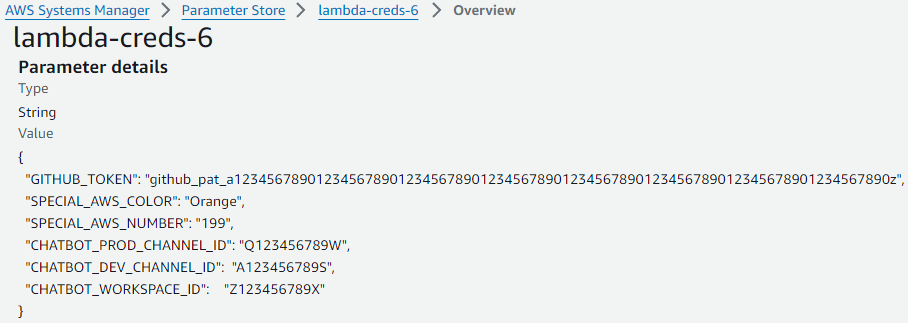

# AWS CI/CD Pipeline Deploy


##  Changes Required
AWS account number

    /cicd/cdk.json

      "ACCOUNT_NUMBER": "999999999999",

      "ACCOUNT_NUMBER": "999999999999",

DNS & GitHub

    /cicd/program.config.json
      
      "C_cicd_web_DOMAIN_NAME": "your-domain.click",
      
      "C_cicd_GITHUB_REPO": "your-github-repo",

      "C_cicd_GITHUB_OWNER": "your-github-name",

AWS Sytems Manager Parameter Store name

    /cicd/program.config.json

        "C_cicd_SSM_SECRETS_NAME": "lambda-creds-6",

## Initialize

```bash
$ aws configure
    AWS Access Key ID [None]: abcdefghijklmnopqrst 
    AWS Secret Access Key [None]: ABCDEFGHIJKLMNOPQRSTUVWXYZ1234567890abcd
    Default region name [None]: us-east-1
    Default output format [None]: json

$ cd cicd
$ yarn
$ yarn cicd-prog bootstrap 

$ cd server
$ yarn

$ cd web
$ yarn
```


## Pipeline Parameters on AWS

 [ AWS Systems Manager > Parameter Store > lambda-creds-6 > Overview](https://us-east-1.console.aws.amazon.com/systems-manager/parameters/lambda-creds-6/description?region=us-east-1&tab=Table) 
 
 For values not stored in the GitHub repository. SPECIAL_AWS_COLOR and SPECIAL_AWS_NUMBER are injected into the /web by the pipeline. While the other values are used by the pipeline to get the source from GitHub and make a Slack ChatBot.





GITHUB_TOKEN - github_pat_a123... : https://github.com/settings/tokens?type=beta


 CHATBOT_PROD_CHANNEL - Q123456789W : [ https://app.slack.com/client/Z123456789X/**Q123456789W**](https://app.slack.com/client/Z123456789X/A123456789S) 

  CHATBOT_DEV_CHANNEL - A123456789S : [ https://app.slack.com/client/Z123456789X/**A123456789S**](https://app.slack.com/client/Z123456789X/A123456789S) 


 CHATBOT_WORKSPACE_ID - Z123456789X : [ https://app.slack.com/client/**Z123456789X**/A123456789S](https://app.slack.com/client/Z123456789X/A123456789S) 


## Install & Change AWS CodePipeline
```bash
START Docker Desktop

$ yarn cicd-build

$ yarn cicd-to-pipeline synth          > ../../pipeline_synth.yaml
$ yarn cicd-to-pipeline deploy  

$ yarn cicd-to-pipeline destroy 
$ yarn cicd-to-pipeline diff           > ../../pipeline_diff.yaml
```


