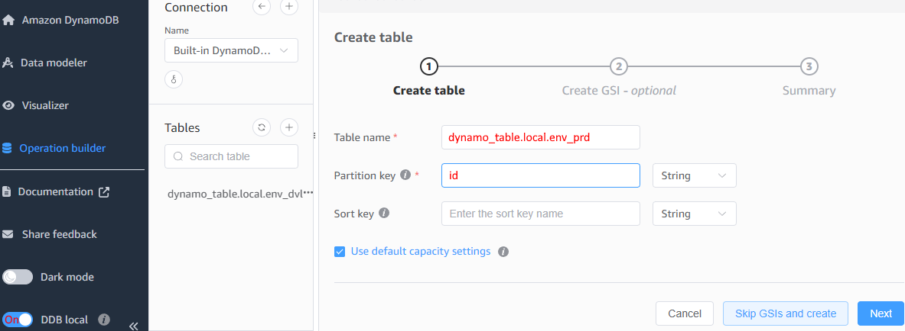

<a name="s"></a>


## What is this?
This is a fork of "[AWS CDK in Practice](https://github.com/PacktPublishing/AWS-CDK-in-Practice)" from [Packt](https://www.packtpub.com/en-us/product/aws-cdk-in-practice-9781801812399) which shows how to build cloud applications with AWS CDK in TypeScript.


This example, which can be developed locally, uses Lambdas, DynamoDB, and Cloudfront. The program saves RBG values to DynamoDB. The [production version](https://front-prod.steenhansen.click/index.html) and the [development version](https://front-dev.steenhansen.click/index.html) are hosted on AWS. Note that when first deployed on AWS the program takes a few seconds to wake up.


##  Prerequisites

  [NVM](https://github.com/coreybutler/nvm-windows/releases) for Node.js 20 and NPM

```console
$ nvm install 20.16.0
$ nvm use 20.16.0
$ npm install --global yarn
```

  [AWS Command Line Interface](https://aws.amazon.com/cli/) for terminal CLI

  [NoSQL Workbench for DynamoDB](https://docs.aws.amazon.com/amazondynamodb/latest/developerguide/workbench.settingup.html) for local testing of DynamoDB

  [Docker Desktop](https://www.docker.com/products/docker-desktop/) for building containers

  [ConEmu](https://conemu.github.io/) for good multi-tab terminal windows

## Initialize 

```bash
$ cd cicd
$ yarn

$ cd server
$ yarn

$ cd web
$ yarn
```

Create local copies of dynamo_table.local.env_dvl and dynamo_table.local.env_prd in NoSQL Workbench


## Build Program
Both /server and /web depend on /cicd
```bash
$ yarn cicd-build

$ yarn server-build     

$ yarn web-build   
```

## Local Developement
```bash
START NoSQL Workbench for Amazon DynamoDB

$ yarn cicd-build

$ yarn server-build
$ yarn server-start

$ yarn web-build
$ yarn web-start
```

## Local Tests - slow to start
```bash
$ yarn cicd-build
$ yarn cicd-test

$ yarn server-build
$ yarn server-test
$ yarn server-start

$ yarn web-build
$ yarn web-test
```
If Antimalware Service Executable goes to 100% try below
```bash
$ Set-MpPreference -DisableRealtimeMonitoring $true
```
## Production Versus Development

 In /cicd/cdk.json the value of global_consts.Work_Env sets the type of program.
 
 Production version


    "global_consts": {
      "WORK_ENV": "Env_prd"
    },


 Development version

    "global_consts": {
      "WORK_ENV": "Env_dvl"
    },


# [Minimal Direct Deploy to AWS](./cicd/README-to-cloud.md)
  - No GitHub
  - No CI/CD pipeline

# [AWS CI/CD Pipeline Deploy](./cicd/README-to-pipeline.md)
  - Deploy via GitHub changes
  - Must use region "us-east-1" for Route 53 DNS