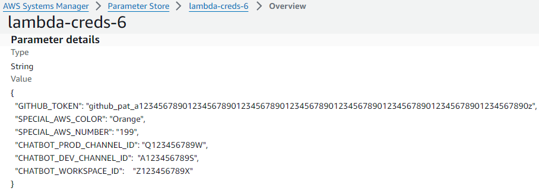

## What is this?
An AWS CDK Pipeline Typescript example using Lambdas, DynamoDB, and Cloudfront.
Can be developed completely locally. The program saves RBG values to a database. The [production version](https://front-prod.steenhansen.click/index.html) and the [development version](https://front-dev.steenhansen.click/index.html). Note that when first deployed on AWS it takes a few seconds to wake up.


##  Prerequisites

  [NVM](https://github.com/coreybutler/nvm-windows) for Node.js and NPM


  [AWS Command Line Interface](https://aws.amazon.com/cli/) for terminal CLI


  [NoSQL Workbench for DynamoDB](https://docs.aws.amazon.com/amazondynamodb/latest/developerguide/workbench.settingup.html) for local testing of DynamoDB

  [Docker Desktop](https://www.docker.com/products/docker-desktop/) for deploying to AWS

  [ConEmu](https://conemu.github.io/) for good terminal windows

##  Configuration Files
    /cicd/cdk.json
      Production or development
      GitHub branch names
      AWS account numbers
      AWS regions

    /cicd/program.config.json
      Domain name
      GitHub
      Miscellaneous names

    /cicd/program.constants.json
      Constants

    /cicd/program.switches.json
      Toggles

##  Changes Required
AWS account number

    /cicd/cdk.json

      "ACCOUNT_NUMBER": "211125473900",

DNS & GitHub

    /cicd/program.config.json
      
      "C_cicd_web_DOMAIN_NAME": "steenhansen.click",
      
      "C_cicd_GITHUB_REPO": "AWS-CDK-in-Practice_example",

      "C_cicd_GITHUB_OWNER": "steenhansen",

AWS Sytems Manager Parameter Store name

    /cicd/program.config.json

        "C_cicd_SSM_SECRETS_NAME": "lambda-creds-6",


## IAM User Permissions
  The AWS user's credentials entered below must have "AdministratorAccess" permission

## Initialize
```bash
aws configure
  AWS Access Key ID [None]: abcdefghijklmnopqrst 
  AWS Secret Access Key [None]: ABCDEFGHIJKLMNOPQRSTUVWXYZ1234567890abcd
  Default region name [None]: us-east-1
  Default output format [None]: json

cd cicd
yarn
yarn cicd-prog bootstrap 

cd server
yarn

cd web
yarn
```

## Build Program
```bash
yarn cicd-build

yarn server-build       // depends on cicd

yarn web-build          // depends on cicd
```

## Local Developement
```bash
START NoSQL Workbench for Amazon DynamoDB

yarn cicd-build

yarn server-build
yarn server-start

yarn web-build
yarn cross-env REACT_APP__SPEC_COLOR=Orange REACT_APP__SPEC_NUM=199 yarn web-start
```

## Local Tests
```bash
yarn cicd-build
yarn cicd-test

yarn server-build
yarn server-test
yarn server-start

yarn web-build
yarn web-test
```


## Pipeline Parameters on AWS

 [ AWS Systems Manager > Parameter Store > lambda-creds-6 > Overview](https://us-east-1.console.aws.amazon.com/systems-manager/parameters/lambda-creds-6/description?region=us-east-1&tab=Table) 
 
 For values not stored in the GitHub repository. SPECIAL_AWS_COLOR & NUMBER are injected into the /web by the pipeline. While the other values are used by the pipeline to get the source from GitHub and make a Slack ChatBot.





GITHUB_TOKEN - https://github.com/settings/tokens?type=beta


 CHATBOT_PROD_CHANNEL : [ https://app.slack.com/client/Z123456789X/**Q123456789W**](https://app.slack.com/client/Z123456789X/A123456789S) 

  CHATBOT_DEV_CHANNEL : [ https://app.slack.com/client/Z123456789X/**A123456789S**](https://app.slack.com/client/Z123456789X/A123456789S) 


 CHATBOT_WORKSPACE_ID : [ https://app.slack.com/client/**Z123456789X**/A123456789S](https://app.slack.com/client/Z123456789X/A123456789S) 


## Install & Change AWS CodePipeline
```bash
START Docker Desktop

yarn cicd-build

yarn cicd-pipeline bootstrap
yarn cicd-pipeline synth          > ../../pipeline_synth.yaml
yarn cicd-pipeline deploy  

yarn cicd-pipeline destroy 
yarn cicd-pipeline diff           > ../../pipeline_diff.yaml
```


## Direct Non-GitHub Program Deploy to AWS
```bash
START Docker Desktop

yarn cicd-build
yarn server-build
yarn web-build

yarn cicd-prog bootstrap
yarn cicd-prog synth              > ../../deploy_synth.yaml  
yarn cicd-prog deploy

yarn cicd-prog destroy
yarn cicd-prog diff               > ../../deploy_diff.yaml
```


